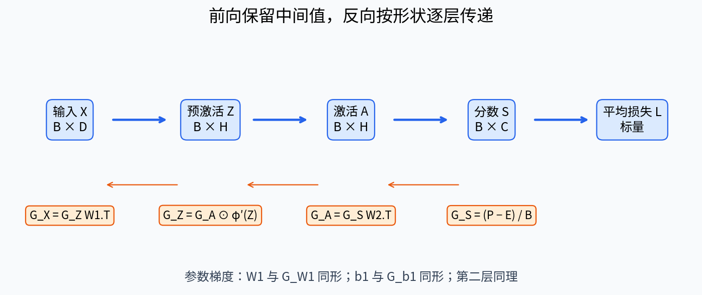
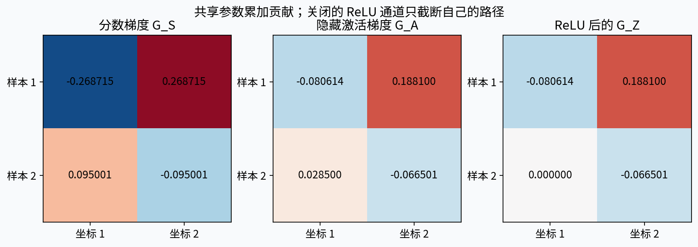
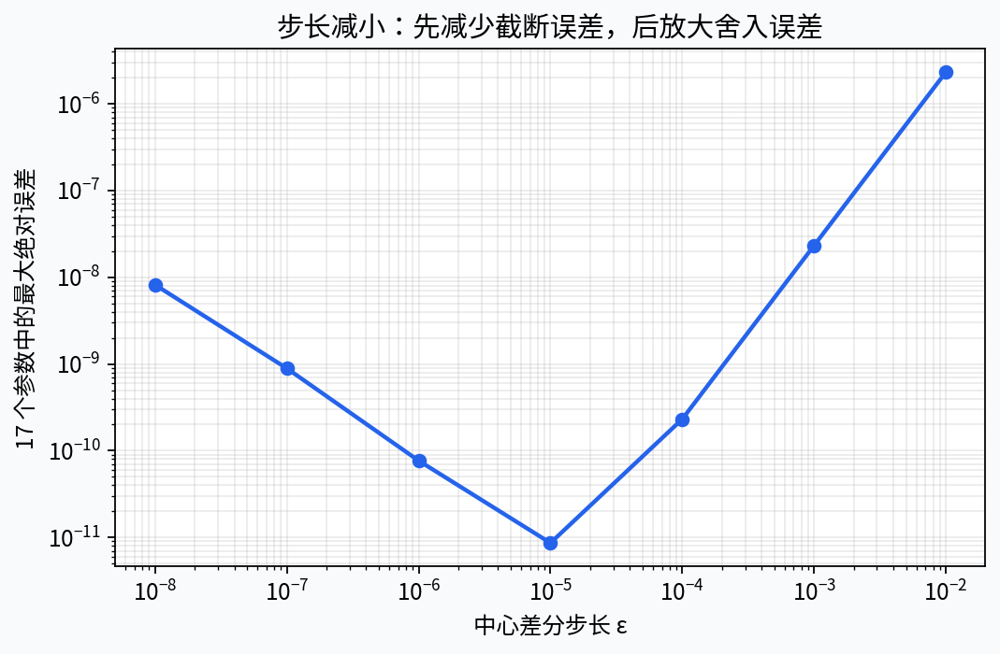
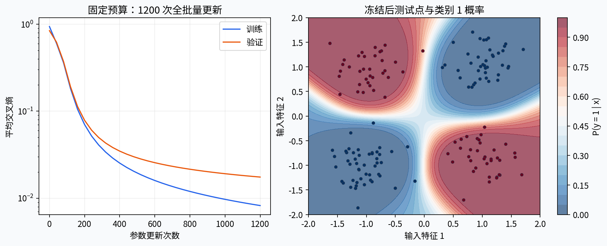

# 第085课 反向传播的完整推导

> 核心问题：一个预测错误怎样逐层变成每个权重和偏置的梯度？本课把单个标量、成批矩阵、手算数字和可运行程序放在同一条链上。最后你应能解释每一个转置、每一次求和和唯一的一次批量平均，而不是凭报错尝试修改代码。

直接先修：014多元导数与链式法则、039优化实现与故障诊断、043多分类与信息论损失、083多层感知机与表示能力和084计算图与自动微分。若对导数陌生，请先记住“导数描述非常小的输入变化引起多大的输出变化”。本课采用样本按行排列的约定；换一本教材看见转置位置不同，先检查它是否把样本写成列。

## 1 场景：两种传感器组合决定报警

设一台设备有两个归一化传感器读数。只有两个状态不一致时才报警，这近似异或关系。单个线性边界无法把四个角落按异或分开，隐藏层可以先把输入变成新的表示。第083课回答“这种网络能够表达什么”，第084课回答“计算图怎样传递导数”，本课回答“把规则展开以后，每一块参数的具体公式是什么”。

我们不把合成报警数据当工业安全系统。真实报警还涉及误报成本、漏报风险、分布变化和校准。本课数据仅用于隔离实现问题：生成机制已知、规模很小、离线可重复。如果一个网络在这套数据上都不能学习，首先应该检查实现；如果能学习，也不能据此承诺真实设备可靠。

反向传播只负责在当前参数处计算目标的梯度。优化器接收梯度后决定怎么移动参数。两者像温度计与调温开关：读数正确并不保证控制策略合适。学习率过大时，即使梯度完全正确，损失仍可能升高。不要把“训练没下降”立即判作“反向传播公式错了”。

## 2 先给每一个对象贴上形状标签

令批量大小为$B$、输入维数为$D$、隐藏单元数为$H$、类别数为$C$。输入矩阵$X\in\mathbb R^{B\times D}$的一行是一条样本；整数标签$y\in\{0,\ldots,C-1\}^{B}$的一项给出这一行的正确类别。标签不是连续数值回归目标，类别编号之间的距离不表示语义距离。

第一层权重$W_1\in\mathbb R^{D\times H}$，偏置$b_1\in\mathbb R^H$；第二层权重$W_2\in\mathbb R^{H\times C}$，偏置$b_2\in\mathbb R^C$。偏置没有批量维，因为一批所有样本共享同一组偏置。参数总数为$DH+H+HC+C$。主训练网络是$2\rightarrow8\rightarrow2$，共42个标量参数；审计网络是$2\rightarrow3\rightarrow2$，共17个。

在代码中，形状既是文档也是一种类型约束。$XW_1$必须让内侧的$D$相同，结果才是$B\times H$。矩阵乘法的结果若“恰好能广播”不等于语义正确，尤其当$B=H$或$B=C$时，错误的轴更容易藏起来。调试时选不同的维度，例如$B=5,D=2,H=3,C=4$，能让许多错误尽早暴露。

## 3 完整前向：从输入到一个标量

前向按四个阶段进行：

$$Z=XW_1+\mathbf1_B b_1^\top,\qquad A=\phi(Z),\qquad S=AW_2+\mathbf1_B b_2^\top.$$

$Z,A$都是$B\times H$；$S$为$B\times C$，其中每一行是未归一化类别分数，也叫logits。符号$\mathbf1_B$是含$B$个1的列向量，它把同一偏置复制到每条样本。NumPy广播省去了显式复制，但数学上的共享没有消失。后面偏置梯度的求和正是这种共享的反方向。

对第$i$行，softmax概率为

$$P_{ic}=\frac{\exp(S_{ic})}{\sum_{k=1}^C\exp(S_{ik})},\qquad \ell_i=-\log P_{i,y_i},\qquad L=\frac1B\sum_{i=1}^{B}\ell_i.$$

这里有两个不同的求和轴。softmax在同一条样本的类别轴上归一化；平均损失在样本轴上归约。如果把前者写成跨样本归一化，同一条样本的预测就会依赖它与哪些别的样本放在一起，本课的分类模型已被改变。

## 4 数值稳定是前向定义的一部分

数学实数中的指数永远存在，浮点数却有表示范围。直接计算$\exp(1000)$可能溢出。利用一行分数整体平移不改变softmax的性质，设$m_i=\max_c S_{ic}$，先得到$T_{ic}=S_{ic}-m_i$，然后计算

$$\log P_{ic}=T_{ic}-\log\sum_k\exp(T_{ik}).$$

所有$T_{ic}\leq0$，至少一项为0，因此至少有一个指数为1，分母不会全部下溢。代码直接从稳定的对数概率取交叉熵，不先得到一个可能下溢到0的概率再取对数。预测时为了展示可以计算概率，但损失计算应走稳定路径。

这里的最大值只是实现等价表达式的辅助量。虽然最大函数在并列处可能不可微，整个稳定表达式仍与原始光滑的log-sum-exp相同；完整微分中的平移项会抵消。实现反向时直接使用化简后的概率公式，可以避免初学者在辅助最大值的路径上绕远路。测试会给全部类别偏置加10000，检查损失和概率基本不变。

## 5 先从单条样本推导交叉熵

对一条样本，令$e_c$表示正确类别的独热编码：正确类别处为1，其他位置为0。交叉熵可以写为

$$\ell=-\sum_c e_cS_c+\log\sum_k e^{S_k}.$$

对某个分数$S_j$求导。第一项只有$c=j$的一项与它直接相关，导数为$-e_j$。第二项用对数的导数，再用指数的导数，得到$\exp(S_j)/\sum_k\exp(S_k)=P_j$。所以

$$\frac{\partial\ell}{\partial S_j}=P_j-e_j.$$

正确类别若概率偏低，它对应的导数为负，梯度下降倾向提高该分数；错误类别的导数为正，梯度下降倾向降低这些分数。不过具体参数同时影响多个分数和多个样本，不能把一个局部导数直接解释为每个权重都应朝相同方向改变。

本公式默认普通硬标签、未加类别权重、未加标签平滑，损失按样本平均。软标签也有相似公式，但标签必须形成适当的分布；类别权重和不同归约规则会改变缩放。以后使用框架损失时要读清默认约定，不能机械复用一句“梯度就是概率减标签”。

## 6 批量平均的因子只出现一次

用$E\in\mathbb R^{B\times C}$表示整批独热标签。定义反向伴随量$G_S=\partial L/\partial S$，则

$$G_S=\frac{P-E}{B}\in\mathbb R^{B\times C}.$$

我们把$1/B$放在反向起点，此后所有层都只做链式规则，不再按批量除一次。也可以先计算逐样本梯度，最后统一平均，但两种写法不能混合，否则会得到$1/B^2$。这类错误很隐蔽：当$B=1$时测试全部通过，换批量大小后学习速度才异常。

复制整批数据两次是一个非常强的性质测试。若目标仍是平均损失，复制后目标数值和梯度都应保持不变。若目标是总和损失，复制后两者都应加倍。主实验明确测试这两条关系，并故意用总和梯度对照平均损失的有限差分，确认漏除批量因子的错误能够被发现。

图1是原创形状路线图。上方读取前向表示，下方读取相应梯度；箭头不是数据真的倒着流动，而是导数依赖按逆拓扑顺序被计算。每个参数梯度都与自己的参数形状一致。

## 7 第二层权重：先展开一个元素

第二层分数的元素为$S_{ic}=\sum_{h=1}^{H}A_{ih}(W_2)_{hc}+(b_2)_c$。固定一个权重$(W_2)_{hc}$，它被全部样本使用，所以

$$\frac{\partial L}{\partial(W_2)_{hc}}=\sum_{i=1}^{B}\frac{\partial L}{\partial S_{ic}}\frac{\partial S_{ic}}{\partial(W_2)_{hc}}=\sum_i(G_S)_{ic}A_{ih}.$$

把每一个$h,c$的结果排成矩阵，恰好就是

$$G_{W_2}=A^\top G_S\in\mathbb R^{H\times C}.$$

转置不是为了让程序“能乘”；它来自同一个隐藏坐标$h$与同一个类别$c$跨样本做配对求和。形状核查给出$(H\times B)(B\times C)=H\times C$，与$W_2$一致。若只会记公式，可以回到这一项展开式重新推出来。

## 8 第二层偏置：广播的逆操作是归约

每条样本的$S_{ic}$对$(b_2)_c$的导数都是1。因此

$$G_{b_2,c}=\sum_i(G_S)_{ic},\qquad G_{b_2}=\operatorname{sum}_{i}(G_S)\in\mathbb R^C.$$

这里是求和，不是再求平均，因为$G_S$已经含有$1/B$。代码写成`dS.sum(axis=0)`。如果偏置保存成$(1,C)$，可以保留维度得到同样布局；本课保存成$(C,)$，所以不保留第一维。

这个例子可以推广：某个值在前向中被复制到多个位置，反向就把这些位置的贡献加起来。求和说明参数共享，不能理解成“梯度突然变大了所以应该除掉”。是否平均由损失定义决定，是否累加由计算图中有多少使用路径决定。

## 9 传回隐藏表示：一个隐藏量影响所有类别

固定$A_{ih}$，它会通过第二层影响同一条样本的全部类别分数，所以

$$\frac{\partial L}{\partial A_{ih}}=\sum_c(G_S)_{ic}(W_2)_{hc},\qquad G_A=G_SW_2^\top\in\mathbb R^{B\times H}.$$

这一步与权重梯度求和的轴不同。权重被所有样本共享，因此权重梯度跨样本求和；某条样本的隐藏表示影响自己的各个类别，因此表示梯度跨类别求和。把“为什么求和”和“对哪个轴求和”分开理解，比同时背两个矩阵公式可靠。

必须使用前向时那一版$W_2$。错误做法是先更新$W_2$，再拿新权重去算$G_A$；这样第一层梯度与第二层梯度不再对应同一个参数点的目标函数。本课先算完四块梯度，再统一交给`sgd_step`产生新参数字典。

## 10 激活导数是逐元素门控

激活按元素作用，所以每个$Z_{ih}$只影响相同位置的$A_{ih}$，没有在隐藏坐标之间混合。因此

$$G_Z=G_A\odot\phi'(Z)\in\mathbb R^{B\times H}.$$

符号$\odot$表示逐元素乘法，不是矩阵乘法。本课训练用双曲正切，$A=\tanh Z$，所以$\phi'(Z)=1-A^2$。使用缓存的$A$避免再计算一次双曲正切。它在原点附近导数较大，在绝对值很大时趋近0，说明局部饱和会削弱传回的梯度。

纸笔例子用ReLU，便于算出简单前向数字。对$z>0$，导数为1；对$z<0$，导数为0；在$z=0$处普通导数不存在，代码选择0作为约定。有限差分如果跨越这一折点，可能与所选约定不一致，因此审计应选择远离折点的位置，或者使用光滑激活。不能把不可微点的数值差异一概当实现错误。

## 11 第一层权重、偏置与输入梯度

第一层和第二层具有同样的仿射结构，只是输入从$A$换成$X$，输出伴随量从$G_S$换成$G_Z$。逐项应用相同推导得到

$$G_{W_1}=X^\top G_Z\in\mathbb R^{D\times H},\qquad G_{b_1}=\sum_i(G_Z)_{i,:}\in\mathbb R^H.$$

若需要对输入求导，再计算

$$G_X=G_ZW_1^\top\in\mathbb R^{B\times D}.$$

普通监督训练中输入不是待学习参数，因此我们通常不更新$X$；输入梯度仍可用于敏感性分析、对抗样本或更前面网络的反向传播。它描述模型在当前点附近对输入的局部响应，不能单凭梯度大小就断言现实因果重要性，尤其当特征量纲不同时。

到此完整路线已经闭合：标量损失提供一个反向起点，分数梯度向后经过第二层、激活和第一层，四块参数都有明确的梯度。计算量与前向同数量级，不需要为每个参数单独重跑一次完整网络，这就是反向模式适合“很多参数、一个标量目标”的原因。[1]

## 12 一批两条样本的完整手算

设$B=2,D=H=C=2$，激活为ReLU。取

$$X=\begin{bmatrix}1&2\\-1&1\end{bmatrix},\quad W_1=\begin{bmatrix}1&-1\\0.5&1\end{bmatrix},\quad b_1=\begin{bmatrix}0&0.5\end{bmatrix},$$

$$W_2=\begin{bmatrix}0.2&-0.1\\-0.3&0.4\end{bmatrix},\quad b_2=\begin{bmatrix}0.1&-0.2\end{bmatrix},\quad y=(0,1).$$

第一条样本的第一个隐藏预激活为$1\times1+2\times0.5+0=2$；第二个为$1\times(-1)+2\times1+0.5=1.5$。第二条样本同理得到$(-0.5,2.5)$。于是

$$Z=\begin{bmatrix}2&1.5\\-0.5&2.5\end{bmatrix},\quad A=\begin{bmatrix}2&1.5\\0&2.5\end{bmatrix},\quad S=\begin{bmatrix}0.05&0.20\\-0.65&0.80\end{bmatrix}.$$

注意第一条样本的正确类别是0，网络却把类别1的分数给得更高；第二条样本的正确类别是1，当前方向正确。不能把“第一条错、第二条对”直接换成梯度0或1，交叉熵还会反映预测置信程度。

## 13 手算继续：从概率到全部参数

第一行概率约为$(0.462570,0.537430)$；第二行约为$(0.190002,0.809998)$。平均损失约为0.490840。将独热标签相减并除以2，得到

$$G_S\approx\begin{bmatrix}-0.268715&0.268715\\0.095001&-0.095001\end{bmatrix}.$$

接着$G_{W_2}=A^\top G_S$，第一行只用第一条样本的隐藏值2，因此约为$(-0.537430,0.537430)$；第二行同时累加两条样本，约为$(-0.165570,0.165570)$。偏置梯度约为$(-0.173714,0.173714)$。这些数值的正负相反来自本例只有两个类别且每行分数梯度和为0。

再计算$G_A=G_SW_2^\top$。第一行约为$(-0.080614,0.188100)$，第二行约为$(0.028500,-0.066501)$。ReLU把第二条样本的第一个分量截为0，所以$G_Z$的第二行成为$(0,-0.066501)$。最后用$X^\top G_Z$得到第一层权重梯度，偏置则沿样本求和。完整数字保存在`experiment-result.json`，答案册逐项列出，方便检查你究竟在哪一步开始偏离。

图2把本例的$G_S$、$G_A$与$G_Z$并排显示。右图第二行第一列为0，不代表这条样本不产生梯度，而是这一个ReLU通道在当前输入下关闭，其他路径仍然有效。

## 14 用微分形式再核验一次

如果你熟悉矩阵微分，可以用另一种方式检查公式。对$S=AW_2$，微小变化满足$dS=dA\,W_2+A\,dW_2$。定义矩阵内积$\langle U,V\rangle=\sum_{ij}U_{ij}V_{ij}$，则$dL=\langle G_S,dS\rangle$。把两项分别整理为与$dA$和$dW_2$的内积，就得到$G_A=G_SW_2^\top$与$G_{W_2}=A^\top G_S$。

初学者不需要一开始就掌握迹运算。这一节的作用是说明公式可以由两条不同道路得到：元素级链式法则与矩阵微分相互支持。代码测试是第三条道路，但三者并非互相替代。有限数量的测试无法证明任意输入都正确；数学推导也不能保证实现没有轴写错。

## 15 有限差分是一把尺，不是训练发动机

对参数向量的第$j$个标量，中心差分为

$$g_j^{\mathrm{num}}=\frac{L(\theta+\varepsilon e_j)-L(\theta-\varepsilon e_j)}{2\varepsilon}.$$

每检查一个参数，需要两次前向。如果有一百万个参数，逐个做这种检查非常昂贵；反向传播一次可同时求全部梯度。因此本课在17参数的小网络上检查每一个标量，在42参数主网络上再训练。不能把只检查一两个随机参数说成“所有参数验证通过”。

比较误差时同时看绝对误差和合理缩放后的误差。一个真实梯度接近0时，相对误差可能因为分母过小而夸张；一个很大的梯度则可能拥有不小的绝对误差但很小的相对误差。本实验记录每块参数的最大绝对误差，并用$\max(1,\|g\|,\|g_{num}\|)$缩放整体范数，避免零分母。

## 16 为什么差分步长不是越小越好

中心差分用有限距离近似局部斜率，$\varepsilon$太大时截断误差明显；太小时两次几乎相同的浮点损失相减，会放大舍入误差。实验扫描$10^{-2}$到$10^{-8}$，误差通常先下降再回升。这不是理论矛盾，而是数学近似和计算机有限精度共同作用。

我们用float64与平滑tanh，冻结输入、参数和标签，不在差分中插入随机dropout，不让训练状态或数据顺序变化。每次扰动后恢复原参数，并测试原参数没有被修改。若一个“梯度检查器”在计算过程中偷偷改变模型，它得到的比较就失去了共同基准。[2]

图3的横轴、纵轴都是对数尺度。本次最小误差出现在约$10^{-5}$附近；这个数不应被当作所有模型通用的最佳步长。函数尺度、数值类型和参数范围变化时，应重新观察稳定区间。

## 17 从梯度走到更新：明确优化器的职责

最简单的随机梯度下降更新是$\theta_{t+1}=\theta_t-\eta g_t$。$\eta$为学习率，必须结合目标缩放理解。把平均损失改成总和损失而不改学习率，更新量会放大约$B$倍。损失数值本身还会随批量大小改变，跨实验直接比较也会误导。

本课主实验用全批量梯度下降，323条训练样本一起计算梯度，学习率0.15，固定1200次更新。这里每次更新也相当于看完训练集一次，但下一课使用小批量以后，一个epoch内会发生许多次更新，所以“训练轮数”和“更新次数”不能再互换。

小步长下，沿负梯度方向局部应使可微损失下降，测试中用$10^{-3}$检查这一性质。它仍不是任意步长都下降的保证。非凸网络可能存在鞍点、平坦区和多种等价参数；我们展示的是一条可重复的优化轨迹，而不是全局最优证明。

## 18 数据划分先于训练

合成数据由四个二元角落加独立高斯噪声构成，标签来自加噪前两个二元位的异或。训练323条、验证157条、测试160条，使用固定种子85086一次生成。它们是独立抽样，职责在训练前冻结。全部数据随教材保存，运行时不下载任何文件。

085固定架构、步数和学习率，不根据验证结果选择检查点；验证曲线只是诊断，测试在训练结束后评价一次。086会演示在验证集选择检查点，两讲的协议要分别阅读。若你根据085测试结果不断修改隐藏宽度，那么测试集已经参与选择，新的最终结论需要新的保留数据。

不需要在这套对称数据上额外拟合标准化器，但真实特征尺度不同的时候通常需要。此时均值和标准差只能由训练集估计，验证和测试使用同一变换。预处理也是训练管道的一部分，而不是能够绕过数据职责的“无监督准备”。

## 19 读取实测结果，而不是只看漂亮曲线

冻结运行使用Python 3.12.14、NumPy 2.3.5与CPU float64。17个参数的中心差分最大绝对误差约为$8.63\times10^{-12}$；复制整批后的平均梯度差约为$2.78\times10^{-17}$。这些结果支持当前实现与当前审计点一致，不能代替更多边界测试。

训练平均交叉熵由0.938143下降到0.008241，训练准确率为1.0；验证损失0.017510、准确率约0.987261；测试损失0.012261、准确率1.0。测试只有160条合成样本，1.0不是总体错误率严格为0，也不是对所有噪声水平或所有随机种子的保证。

图4左边显示训练和验证损失，右边显示网络在二维平面上的类别1概率与保留测试点。连贯的边界是函数值的可视化，不是概率校准证书。颜色饱和区域并不代表模型在训练分布之外有可靠知识。

## 20 四类最常见的实现错误

第一类是形状错误。把$X^\top G_Z$写成$G_Z^\top X$会得到转置布局；若后续又随手转一次，代码可能运行，但参数约定变得混乱。应在函数入口验证形状，用元素级公式定位，而不是不停尝试转置。

第二类是归约错误。对偏置梯度取均值、同时起点又除$B$，就多除一次；只在某一层漏除$B$，则不同层相对学习率被改变。复制批量、比较sum和mean、让$B$不等于1，三种测试可以协同定位。

第三类是路径错误。用更新后的第二层权重回传，遗漏共享节点的一条贡献，或者在ReLU前后的缓存上用错导数，都会计算出与当前目标不一致的结果。不要用调小学习率掩盖这些问题。

第四类是目标错误。对softmax概率再当logits输入一个内部含softmax的损失，会改变函数；训练准确率提高也不证明目标正确。先把损失的数学定义写在纸上，再检查代码实现的是哪一个函数。

## 21 加入正则项时哪里改变

若目标定义为$L_{total}=L_{data}+\frac\lambda2(\|W_1\|_F^2+\|W_2\|_F^2)$，则权重梯度分别增加$\lambda W_1$与$\lambda W_2$，偏置是否正则化取决于你的定义。本课代码不加入这个项，避免对齐实验多一个变量；这里用于训练你阅读目标而不是记住固定程序。

尤其要注意正则项是不是也被放在平均符号里。$\frac1B\sum_i\ell_i+\lambda R$与$\frac1B(\sum_i\ell_i+\lambda R)$具有不同的正则强度。修改批量大小时，第二种写法会改变数据项与正则项的相对权重。以后比较不同软件的weight decay也要先区分它究竟等价于哪一个更新规则。

## 22 反向传播的边界与下一课

推导正确的前提是目标与计算路径符合假设：样本按行、普通交叉熵、确定性前向、指定激活和归约。如果加入样本权重、掩码、序列长度、多个损失头或参数共享，规则仍是链式法则，但求和与归一化必须重新说明。反向传播能处理这些结构，不意味着现成公式不加修改就能覆盖它们。

下一课把同一个NumPy模型移到PyTorch。我们不会以“框架能跑”作为成功标准，而是对齐输入、参数、数值类型和损失，比较前向、全部参数梯度以及一次更新。只要你能逐行解释本课的六条反向公式，框架就会成为减少重复劳动的工具，而不是遮住数学的黑盒。

## 23 把一次错误诊断走完

假设你的网络前向结果与本课一致，第二层权重梯度也一致，但第一层所有梯度恰好小了三倍。不要立刻把第一层学习率乘三。先列出反向检查点：分数梯度、隐藏表示梯度、预激活梯度、第一层参数梯度。逐个打印形状和几个小数，找到第一处不一致的位置。如果差异从预激活开始，要检查激活导数和额外归约；如果预激活一致而参数梯度不一致，要检查矩阵乘法以及是否又取了平均。修正源头后再恢复原学习率，才能让整个模型对应同一个目标函数。

再看另一种情况：每块梯度都与差分相符，但训练损失在第一步暴涨。此时我们已经获得“局部导数实现大致可信”的证据，应转查更新环节。检查符号是否写成加号，学习率是否与损失归约一致，是否把梯度误当参数覆盖，以及参数是否存在非有限值。把学习率暂时缩小后重新运行单步下降测试，可以区分方向错误和步长过大；但单次成功并不能替代完整训练监控。

第三种情况是所有梯度非常接近零，而差分也支持零。它可能是正确的局部性质，例如双曲正切饱和或ReLU路径关闭，并不必然是代码断链。观察预激活分布：如果绝大多数值绝对值很大，先问输入尺度与初始化幅度是否合理。第087课会系统研究这一问题。本课希望建立的习惯是先让证据决定排查方向，而不是为每一种症状都加一个任意常数。

## 24 代码阅读路线与验收证据

先读`numpy_core.py`中的前向四步，再把纸上的六条反向公式逐行对应到变量。缓存中的`H`就是讲义中的隐藏激活$A$；代码中的`dS`、`dH`、`dZ`分别对应三个伴随量。字母不完全相同不会改变数学，阅读时主动做一张映射表即可。然后读`finite_difference`，确认它一次只扰动一个标量、先加后减、最后恢复，并且不调用解析梯度作为数值答案。

接着读`experiment.py`，区分手算例子、审计小网络与主训练网络。三者目的不同，不能混看参数数量。最后运行`test_experiment.py`以及优化解释器版本。测试使用真正的`unittest`断言方法，验证不会因解释器删除普通`assert`语句而消失。通过十项测试是当前覆盖范围内的验收；新增损失、激活或数据形状以后，需要同步新增测试，不能沿用旧的“全绿”当作新功能证据。

## 本课自检

不看答案，解释：为什么第二层权重梯度跨样本求和，而隐藏表示梯度跨类别求和？为什么偏置用sum却仍然对应平均损失？复制整批后平均梯度应怎样变化？ReLU在0附近的差分为什么可能不稳定？为什么必须先完成所有梯度再统一更新？若这些问题还无法回答，请回到对应的元素级推导，而不是再背一遍矩阵公式。

## 参考与核验

[1] Stanford CS231n课程作者维护的反向传播讲义，局部梯度、链式规则和反向累积：https://cs231n.github.io/optimization-2/ 。

[2] Stanford CS231n课程作者维护的神经网络检查建议，中心差分、相对误差、双精度和不可微折点：https://cs231n.github.io/neural-networks-3/ 。

所有图由本课`plots.py`原创生成。上述推导、手算、代码、数据与教学组织均为本课原创；来源核验范围见`sources.md`，不是转载原讲义。
