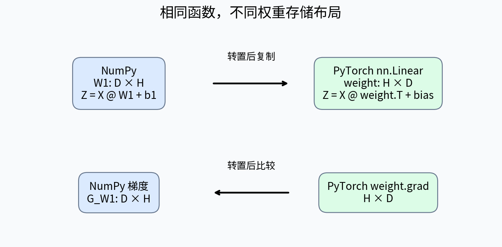
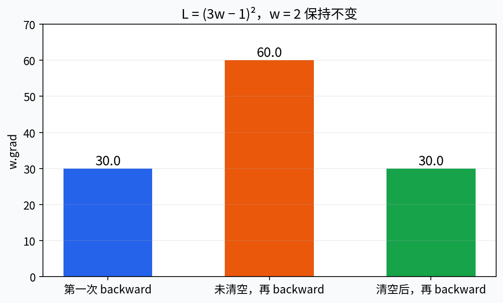
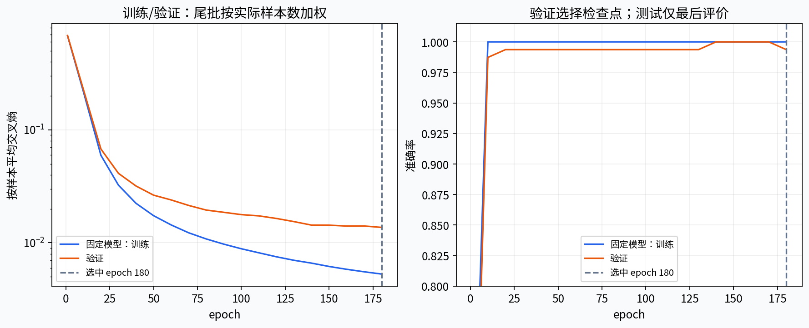
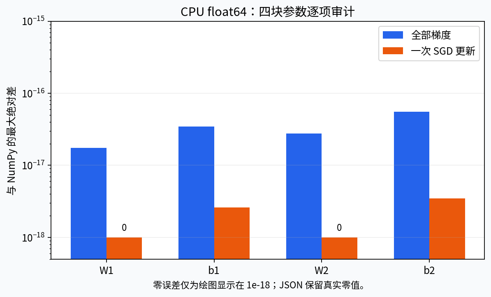

# 第086课 PyTorch与训练循环

> 核心问题：怎样让框架执行已经理解的计算，而不是掩盖它？我们先补齐读懂代码必需的Python类与迭代协议，再把第085课的NumPy网络逐项迁移到真实CPU PyTorch。成功标准包括前向、全部梯度和一步参数更新一致，以及训练、验证和最终测试各尽其责。

直接先修：004至005、007、034、039及085，知识要求包括基础Python、数组操作、实验设计、优化与反向传播。所有数据已经随课保存；实验不需要GPU、不需要联网、不调用在线模型。本次冻结验证实际使用PyTorch 2.14.1+cpu、Python 3.12.14、NumPy 2.3.5。

## 1 为什么先理解语言，再理解框架

初看PyTorch，最吓人的部分往往不是微积分，而是`class`、`super()`、`self`、`__getitem__`和`for X,y in loader`混在一起。如果不知道这些普通Python概念，容易把它们都当成神秘的深度学习语法。实际上，框架通过约定好的接口让不同组件互相协作：模型负责前向，数据集负责取样本，加载器负责组织批量，优化器负责更新参数。

本课沿用二维异或分类。你已知道NumPy前向是矩阵乘法、偏置广播、tanh和另一层矩阵乘法；反向是链式法则。PyTorch的主要便利，是自动记录计算路径、求梯度、登记参数和组织训练，而不是替我们决定数据划分、评价指标或研究结论。框架不会阻止你把测试集用于调参，也不会知道一个训练目标是否符合实际业务。

## 2 类、实例与方法：把状态和操作放在一起

类可以理解为一种对象的定义，实例是按定义创建的具体对象。设类名为`Counter`，里面保存数值`self.value`，并定义方法`add`改变这个值。创建两个实例以后，它们可以各自保存不同状态。`self`是当前实例的引用，不是特殊的张量，也不是一个必须由用户手动传入的普通数据参数。

`__init__`在新实例初始化时执行，常用于准备内部属性。方法与普通函数的差别在于通过实例调用时，Python会把实例绑定为第一个参数。例如`counter.add(2)`可以概念上理解为把`counter`和2交给类中定义的操作。这种绑定机制解释了为什么`forward(self,X)`虽然写了两个参数，调用模型时通常只提供`X`。

属性既可以是数字，也可以是数组或另一个对象。神经网络模型把线性层保存为`self.first`和`self.second`，于是一个模型实例拥有自己的一套参数。不要把模型类名与模型实例混淆：`TwoLayer`是定义，`TwoLayer(8)`得到一个8隐藏单元的具体网络。初始化两个网络，不代表它们自动共享参数。

## 3 继承：遵守共同接口并补充自己的行为

写`class TwoLayer(nn.Module)`表示新类继承PyTorch的模块基类。我们在已有基础上规定自己的层和前向运算。`super().__init__()`让基类先完成必要初始化，其中包括子模块和参数登记机制。它不是可有可无的装饰，也不是执行一次神经网络训练。

在初始化后，把`nn.Linear`实例赋给属性，框架就能找到这些子模块。此后`model.parameters()`可以遍历可训练参数，`state_dict()`可以获得参数和持久缓冲区的状态映射，`model.to(...)`也能递归处理登记的对象。如果把一组层随意放在普通Python列表里而没有登记，可能无法被这些机制正确发现；需要使用合适的模块容器。初学阶段先使用明确命名的属性最容易检查。[1]

我们编写`forward`描述计算，但训练时调用`model(X)`。模块的调用入口除了运行`forward`，还负责框架的钩子等机制。因此通常不要绕过入口直接调用`model.forward(X)`。这不是数学差异，而是软件接口约定；理解接口可以减少日后调试复杂模型时的意外。

## 4 可迭代对象与迭代器：for循环到底拿了什么

可迭代对象能够交给`iter(obj)`产生迭代器；迭代器通过`next(it)`逐个给出元素，结束时抛出`StopIteration`。`for`循环把这些步骤封装起来。列表通常可以反复开始新的遍历；一个已经耗尽的迭代器不会自动回到开头。

把这一点放到训练中看：`loader`是可以重复遍历的数据加载器，每个epoch执行`for X,y in loader`时建立一次新的遍历。若错误地在训练外先写`it=iter(loader)`，然后所有epoch都循环同一个`it`，第一轮后可能没有数据。程序甚至未必报错，只是之后的轮数没有真正执行更新。

`enumerate(loader)`为每个批量再附加一个编号，这个编号表示当前批量位置，不是样本在原始数据中的唯一身份。`len(dataset)`通常是样本数，`len(loader)`通常是批量数；二者用于不同的分母。最后一个批量可能更小，所以不能把每批平均损失简单相加后除以样本数。

## 5 生成器：暂停后继续的函数

普通函数用`return`一次返回结果，生成器函数用`yield`逐步给出结果，并在下次请求时从暂停处继续。例如依次产生批量切片的生成器，可以不用提前把所有批量复制存进列表。调用生成器函数通常先得到生成器对象，函数主体会在迭代请求时执行。

生成器特别适合说明流式数据和懒加载，但它不自动解决随机打乱、多进程、数据错误或复现问题。若在生成器内部读取一个会变化的文件，每轮看到的数据也可能变化；若在内部使用随机数，需要明确随机状态。生成器只规定控制流，不提供实验设计保证。

本课Notebook包含一个两批小数组的生成器例子，让你用`next`观察第一批、第二批和耗尽。实际训练采用Dataset/DataLoader，原因是它们提供标准接口，便于与框架其他功能协作。理解生成器后，你就不会把“loader没有一次返回整个数据集”误判成错误。

## 6 Tensor：数值、形状、类型和位置

Tensor可以先理解为具有更多功能的多维数组。理解一个张量至少要看四件事：`shape`描述维度，`dtype`描述数值表示，`device`描述所在设备，`requires_grad`描述是否参与需要追踪的梯度路径。它们互相独立，不能从“这是一个Tensor”推断它已经在GPU或已经启用梯度。

本课特征使用CPU上的float64，标签使用CPU上的`torch.long`。float64便于严密数值对齐，实际大规模训练经常使用float32或混合精度，但不能因此把所有整数标签也转成浮点。普通类别索引交叉熵要求标签为整型，形状为$(B,)$，值位于0到$C-1$；分数则为浮点，形状$(B,C)$。[2]

`torch.tensor`通常构造新的张量数据；`torch.from_numpy`可与NumPy数组共享底层内存。共享可减少复制，也意味着修改一边可能影响另一边。本课把参数复制到模块时使用`copy_`，导出参数用于比较时使用`.copy()`，避免审计代码意外修改被比较对象。看见两个变量名字不同，不代表它们没有共享存储。

## 7 形状约定与Linear的转置

第085课采用$S=XW+b$，权重形状为$(D,H)$。PyTorch的`nn.Linear(D,H)`把权重保存成$(H,D)$，前向等价于$X\,weight^\top+bias$。因此导入NumPy第一层权重时必须复制$W_1^\top$；第二层同理。偏置形状无需转置。[3]

这不是一个框架更正确的问题，只是存储约定不同。迁移时只比较数组扁平值而忽略布局，会在某些方阵例子中“看起来一样”，到了非方阵就失败。本课选择$2\rightarrow3\rightarrow2$作为审计网络，明确对每一块做布局映射；对导出的权重梯度也转置回NumPy约定以后再比较。

对一批3条输入，第一层输入$(3,2)$、权重存储$(3,2)$、第一层输出$(3,3)$；第二层权重存储$(2,3)$、最终分数$(3,2)$。本例某两个数字偶然相同，因此讲义和代码都用维度语义解释，而不仅凭形状数字判断。你可以把批量改成5，再检查相同映射是否成立。

图1显示同一条数学前向在两种存储约定下如何对应。迁移时保持函数不变，显式改变权重布局；梯度比较也回到共同布局，才有意义。

## 8 autograd记录什么、不记录什么

当需要梯度的张量参与受支持的运算，PyTorch会记录用于反向传播的关系。最后对标量损失调用`backward()`，框架沿实际执行的路径计算梯度，并把叶子参数的梯度累积到`.grad`。网络参数通常是需要梯度的叶子张量；中间结果通常不会默认保留`.grad`，但它们仍参与反向计算。[4]

自动微分不是对每个参数做有限差分，也不是把整个程序变成一串可打印的符号公式。它使用运算局部导数的规则，按计算图组合。这与第084、085课的方法相连。Python控制流可以决定实际执行哪条路径，但如果你把关键计算转到NumPy、取成Python数字或显式分离张量，框架可能无法继续追踪那段路径。

对非标量输出调用反向时，一般需要指定上游向量，含义是向量Jacobian积；本课训练损失已经平均成一个标量，因此隐含上游导数为1。别为了让`backward`不报错随意对任何张量求和，除非求和确实就是你要优化的目标。

## 9 detach、item与no_grad各自用于什么

`detach()`产生与原张量共享数值存储但脱离当前梯度历史的张量，常用于记录或导出结果。如果在损失之前对模型输出detach，参数到损失的路径就被切断。即使程序还能算出一个损失数字，它也无法沿被切断的路径更新模型。不要用detach作为消除梯度报错的万能补丁。

`loss.item()`把只有一个元素的张量转成Python数值，适合日志；应先对原来的`loss`反向，再把数字加入统计。若先写成`loss=loss.item()`，变量已不是能够反向的张量。日志中也不要把每一步仍连着图的损失张量永久放入列表，这会保留不必要的计算历史和内存。

`torch.no_grad()`是一个上下文，用来暂时不记录梯度路径。验证和参数复制通常需要它。它不等价于改变模型的训练状态，也不永久把所有参数冻结。本课用装饰器把`evaluate`整体放在无梯度上下文，并另行执行`model.eval()`。这两步解决不同问题。

## 10 梯度为什么会累积

设$w=2$，损失$L=(3w-1)^2$，则$dL/dw=2(3w-1)\times3=30$。第一次反向后`w.grad`为30。如果保持参数不变，重新前向并再次反向，而不清空梯度，`.grad`变为60；清空后再反向则回到30。实验真的执行这三个步骤，结果写入JSON。

累积不是框架错误。一个参数可能被多个损失或多条路径使用，累加在数学上有用；人为把一个大批量拆成多个微批量，也可能希望累积后只更新一次。但普通“一批一次更新”的循环，应在每批反向之前调用`optimizer.zero_grad(set_to_none=True)`，清除上一批留下的梯度。[5]

把梯度设为None与写成全零张量并非所有场景都完全相同。有些优化器区分“本次没有梯度”与“本次梯度为零”，所以本课不把它们当绝对可互换；我们明确使用None，且所有主模型参数每批都参与计算。None也不是计算出了零梯度，而是当前尚未存放梯度。

图2保持$w$不变，避免混入参数更新影响。实际训练若每次还执行step而不zero，第二次梯度通常不是恰好两倍，因为第二次已在不同的参数位置；但旧梯度仍会错误地留在累积量中。

## 11 Dataset：把“取一条数据”写清楚

本课`ArrayDataset`继承`Dataset`，在初始化中把固定数组转换为特征和标签张量，`__len__`返回样本数，`__getitem__(index)`返回某一条$(x_i,y_i)$。它的职责是解释如何取得一条样本，不在这里更新参数，也不把标签偷偷改成预测结果。

对于一条样本，特征形状为$(2,)$，标签是标量；DataLoader随后把多个样本整理成$(B,2)$与$(B,)$。这解释了为什么你在Dataset中不需要手动增加批量维。若额外加了一层维度，最终可能得到$(B,1,2)$，虽然某些层仍能运行，后续标签匹配和指标归约却可能出错。

真实任务中，Dataset可能读取图片、文本或磁盘文件。预处理如果涉及从数据估计统计量，应在训练集上拟合并固定，再供不同Dataset使用。类的封装不改变数据泄漏的性质：只要验证信息进入训练预处理，代码再整洁也仍然泄漏。[6]

## 12 DataLoader：批量、打乱和尾批

训练加载器使用`batch_size=32`、`shuffle=True`、`drop_last=False`、`num_workers=0`。323条训练数据会产生10个32条批量和最后一个3条批量，共11次更新。验证157条会产生4个32条批量和一个29条批量。故意让样本数不整除批量，能够检验统计量是否正确加权。

训练打乱通过独立的`torch.Generator`固定种子8602。验证和测试不打乱，固定模型训练指标也使用单独的不打乱加载器，避免监控操作消耗训练的随机打乱序列；对于当前逐样本独立模型，固定参数下的全体平均损失不应因顺序改变。训练结果仍会受批量顺序影响，因为每一批之后参数都发生变化。

`num_workers=0`表示当前进程读数据，适合小型离线教学与易复现调试。提高工作进程数可能改善实际吞吐，但也会带来额外随机状态、进程启动和平台差异。不要把更复杂的数据加载配置当作更高级实验的必要标志。先确认取样、标签和批量含义正确，再讨论性能优化。

## 13 一次训练批量的五个阶段

训练每个epoch开始执行`model.train()`。对每个批量依次做：数据移到目标device并核对dtype；清梯度；模型前向得到logits并计算交叉熵；对标量损失反向；优化器更新参数。这里清梯度放在前向前，便于阅读；只要在下一次反向前完成且无其他意外用途，某些教程放在更新后也可以。[7]

交叉熵直接接收logits，不需要先softmax。`argmax`用于计算准确率，不在可微损失路径里；它给出离散类别，但不提供普通训练所需的平滑梯度。准确率适合解释分类对错，交叉熵还对置信度敏感，两者可能不同步变化。

优化器在创建时接收`model.parameters()`的引用。不要在训练中每批重建一个全新模型，却继续使用旧模型的优化器；优化器可能仍在更新旧参数。主代码只创建一次模型和一次SGD，随后反复更新同一组登记参数。迁移device通常也应先完成，再创建优化器，避免参数引用方面的混乱。

## 14 一个epoch的损失怎么正确汇总

第$b$批有$n_b$个样本，批内平均损失为$\bar\ell_b$。整个epoch按样本平均应为

$$\bar L=\frac{\sum_b n_b\bar\ell_b}{\sum_b n_b}.$$

例如一批32条平均损失0.2，尾批3条平均损失1.0，正确值是$(32\times0.2+3\times1.0)/35\approx0.268571$。直接把两个批均值平均得到0.6，会让每条尾批样本获得超过十倍的权重。代码在训练统计中累加`loss.item()*n`，验证直接使用sum归约再除总样本数。

训练中的在线epoch损失还存在另一个语义差别：前一批和后一批是在不同参数下算的，累加结果是这轮训练过程的记录，不等于epoch结束后固定模型在全部训练数据上的损失。本课日志分别保留`train_online`和`train_frozen`，图中主要展示后者与验证损失，以减少比较时的歧义。

## 15 train与eval改变什么

`model.train()`与`model.eval()`设置模块状态，影响遵循这一状态的层，例如Dropout和BatchNorm。普通Linear和tanh在两种状态下公式相同，所以我们的主网络没有状态导致的前向差异；仍然明确写状态切换，是为以后添加这些层保留正确结构。[1]

为了让区别可见，独立演示把1000个1交给概率0.5的Dropout。训练态约一半位置被置零，保留位置会按规则缩放；评价态返回原输入。本次零比例为0.506。它是一次固定种子实现结果，并不是每次必须精确一半。我们不把Dropout加到主对齐网络，以免随机掩码混淆基础审计。

`eval()`不会自动关闭梯度。实验在eval状态下前向，输出仍然`requires_grad=True`；再放入no_grad上下文才关闭记录。因此验证常常需要两者一起使用：eval选择合适的层行为，no_grad避免不必要的计算图。把其中一个当另一个，会在不同模型中留下隐患。

## 16 验证与测试：把职责落实成控制流

每个epoch训练结束后，用验证加载器在eval与no_grad下计算完整指标；如果验证损失更低，就用`copy.deepcopy(model.state_dict())`保存当时状态。简单赋值可能留下共享张量引用，使所谓“最佳状态”随后续训练变化。因此保存的是独立快照，而不是一个会移动的别名。

完成预先固定的180个epoch后，恢复验证损失最低的状态，再评价测试集一次。测试结果不参与选择epoch、学习率或随机种子。主结果的最佳epoch为180；我们没有因为知道测试结果又继续搜索。验证集已用于选择，所以它不再是完全独立的最终性能证据。

真实任务常需要保存到文件的检查点，包括模型、优化器、训练轮数、随机状态和配置。本课为降低依赖与安全复杂性，只在进程内保存状态，并把最终参数作为可审计的数字写入JSON。不要从不可信来源随意加载可执行序列化对象；参数数值文件与任意程序文件的风险并不相同。

图3左边是按epoch记录的固定模型训练/验证损失，右边是准确率；竖线表示验证选择的epoch。验证波动并不意味着反向传播不正确，它还受到小样本和随机批量更新影响。

## 17 device与dtype是两条独立轴

device回答“在哪里计算”，dtype回答“用什么数值表示”。一个模型在CPU float64，输入在CPU float32，位置相同也可能因类型不匹配失败；模型在GPU而输入留在CPU，类型相同也仍然不匹配。标签通常需要和输出在兼容设备上，但保持整数类型。

本课不根据环境自动偷偷切到GPU，明确固定CPU与float64，便于跨实现对照。读者有GPU时可以另开实验，但应把模型和数据迁移策略、随机性与容差变化记录下来。CPU实测不能证明GPU路径已经测试通过，框架支持某设备也不等于本教材在该设备上验证过。

`.to(device=...,dtype=...)`通常返回转换结果，需要接住它；不要写一个调用后继续使用旧变量。另一方面，模块的`.to`会递归变换登记的参数和缓冲区，其行为与普通Tensor转换不能只凭表面语法类比。遇到设备报错时，先打印输入、标签和首个参数的属性，而不是盲目对所有对象重复调用cuda。

## 18 三层对齐：前向、梯度、一次更新

迁移实验首先固定相同的3条输入、标签和17个标量参数，关闭任何随机层，使用CPU float64与平均交叉熵。第一层对齐比较logits及损失，检验前向函数和布局。第二层对齐比较四块参数梯度，检验自动微分结果、损失归约与参数映射。第三层使用同样学习率0.07进行一次无动量SGD，比较更新后的参数。

本次logits最大绝对差约$1.11\times10^{-16}$，损失差为0；梯度各块最大绝对差不超过$5.56\times10^{-17}$；一步更新各块差不超过$3.47\times10^{-18}$。这些接近浮点舍入量级的误差支持迁移一致，而不是要求数学上每一位二进制都相同。其他平台可用$10^{-12}$容差验收本CPU双精度小例。

只比较最后准确率远远不够。两个错误实现都可能在简单任务上达到高准确率，甚至相互抵消的错误可以骗过某一条指标。相反，同一模型不同初始化的最终指标不同，并不自动意味着迁移失败。对齐实验必须先控制共同输入和参数，再讨论训练过程。

图4显示各参数块梯度与一步更新的误差。为使用对数坐标，零误差在图上以$10^{-18}$绘图下限显示，并明确标注；原始JSON仍保存真实的0，避免把视觉处理冒充测量值。

## 19 完整训练的实测与解释

主训练使用$2\rightarrow8\rightarrow2$的tanh网络、SGD学习率0.15、32条小批量和180个epoch，训练集与085相同，但优化路径不同。每个epoch通常有11次更新，因此不能仅按epoch数比较两讲预算。主训练从相同NumPy参数出发，让改变集中在训练组织上。

恢复第180个epoch的最佳验证检查点后，训练损失0.005284、准确率1.0；验证损失0.013676、准确率约0.993631；测试损失0.009207、准确率1.0。独立NumPy对最终模型全部验证样本一次计算的平均损失，与DataLoader按样本加权汇总的结果差约为$3.47\times10^{-18}$，直接检验尾批处理。

这不是PyTorch比NumPy“学得更好”的公平比较，因为更新次数、批量噪声和检查点选择都改变了。它说明两种实现能对齐同一个函数，并能在各自声明的流程中完成训练。若要研究效率或泛化差异，需要统一预算、超参数选择协议、多个随机种子与硬件计时方法。

## 20 有意梯度累积时怎样处理不等大微批量

假设一个逻辑大批量有$N$条样本，被拆成若干微批量。要让累积梯度等于大批量平均损失的梯度，可以对每个微批量计算损失总和，再除以同一个$N$，逐次反向，最后只执行一次step。若每批都用自己的mean再相加，只有批量等大并且再次正确缩放时才等价。

例如逻辑批量35条拆成32和3，正确起点分别是两批sum损失除以35。简单把两个mean各除以2，会把尾批样本过度加权，与上一节统计错误有相同结构。这里我们讨论的是目标函数的梯度权重，不能以“显存不够所以只好这样”作为改变目标却不说明的理由。

本课主循环每批更新一次，不启用梯度累积。本节是为了区分“忘记清梯度”与“有明确目标的累积”。后者还需要考虑随机层和批归一化统计，未必与真正的大批量训练完全等价。掌握基础之后再引入这些优化策略，才能知道等价声明的边界。

## 21 报错与无声错误的排查顺序

先用一小批数据检查形状、dtype、device和标签范围，再打印损失是否有限；随后检查`loss.requires_grad`与参数`.grad`是否存在。若梯度为None，先找断开的路径、未登记参数或没有被使用的分支；若梯度存在但全零，再检查激活饱和、对称性或目标是否真的局部平坦。None与零是两条不同线索。

然后记录一步更新前后参数差。损失可以变化，但如果你不小心更新了另一个模型实例，当前模型参数不会动；优化器也可能拿到一个空列表或错误参数集合。验证时检查参数和梯度没有被改变。本课对此设置单元测试，而不是仅凭阅读代码相信evaluate“应该”没有副作用。

最后再运行完整训练。如果小例对齐通过、单批更新正确而完整结果仍异常，再检查样本与标签是否错位、训练和验证是否采用相同变换、数据是否重复，以及指标的分母是否正确。按由小到大的层级排查，通常比盯着一条最终准确率更有效。

## 22 复现不是只有一个种子

本课明确数据生成种子、参数初始化种子、打乱种子、CPU、float64、线程数和软件版本，并保存冻结数据与结果。设置一个全局种子不能自动控制所有库、数据加载进程或硬件算法。不同设备或软件版本可能有细小数值差异，因此同时保存容差与结论边界。

主程序没有网络调用，PyTorch导入失败会直接报错，测试不会把“框架未安装”当作跳过后通过。普通与`python -O`下都使用真正的unittest检查，防止优化模式移除普通assert造成虚假成功。代码与结果构成证据链：别人可以知道你运行了什么、在什么环境运行、哪些条件被实际检查。

本课的最后一项能力，是分清可重复与可信。相同错误重复十次仍然错误；相同测试集反复调参也可以得到极其稳定的乐观结果。逐项数值对齐支持实现，合理划分支持评价，来源和配置支持复核，三者需要一起存在。

## 23 阅读程序时把职责画出来

`ArrayDataset`只组织单条数据，`make_loaders`只组织批量和顺序，`TwoLayer.forward`只定义预测，损失函数把预测与标签映射成标量，`train_epoch`负责梯度与更新，`evaluate`只读取固定参数并汇总评价，`run`负责训练预算、选择检查点和最终一次测试。这种拆分不是为了追求更多函数，而是让每段代码都有可以独立检查的职责。

你可以问每个函数三个问题：它读了什么数据、改了什么状态、返回的数值是什么意思。例如evaluate虽然不改参数，却会把模型切到eval状态；下一轮train_epoch因此必须主动切回train。虽然主模型没有状态敏感层，这条约定仍需保留。明确副作用，比把所有操作堆进一个循环更利于定位错误。

下一课将研究不同激活、初始化与深度如何影响信号和梯度。届时“代码跑通”已不再是最主要障碍，真正要观察的是张量统计、梯度范数和训练的可行性。本课建立的分层检查方法会继续使用。

## 本课自检

解释为什么权重必须转置、为什么标签不能一律变成float64、为什么验证同时需要eval与no_grad、为什么两次backward会累加，以及为什么不能把不同大小批量的均值直接平均。再不看模板写出完整训练和验证循环，并指出最佳检查点由哪一份数据选择、测试集在哪一刻第一次被读取用于评价。

## 一手资料

[1] PyTorch Module API：https://docs.pytorch.org/docs/2.14/generated/torch.nn.Module.html 。

[2] PyTorch CrossEntropyLoss API：https://docs.pytorch.org/docs/2.14/generated/torch.nn.CrossEntropyLoss.html 。

[3] PyTorch Linear API：https://docs.pytorch.org/docs/2.14/generated/torch.nn.Linear.html 。

[4] PyTorch自动微分入门：https://docs.pytorch.org/tutorials/beginner/basics/autogradqs_tutorial.html 。

[5] PyTorch Optimizer.zero_grad API：https://docs.pytorch.org/docs/2.14/generated/torch.optim.Optimizer.zero_grad.html 。

[6] PyTorch Dataset与DataLoader入门：https://docs.pytorch.org/tutorials/beginner/basics/data_tutorial.html 。

[7] PyTorch优化循环入门：https://docs.pytorch.org/tutorials/beginner/basics/optimization_tutorial.html 。

Python语言桥梁依据官方教程：https://docs.python.org/3.12/tutorial/classes.html 。本课例子、叙述、数据、图和程序独立编写，来源核验范围与版本边界见`sources.md`。
