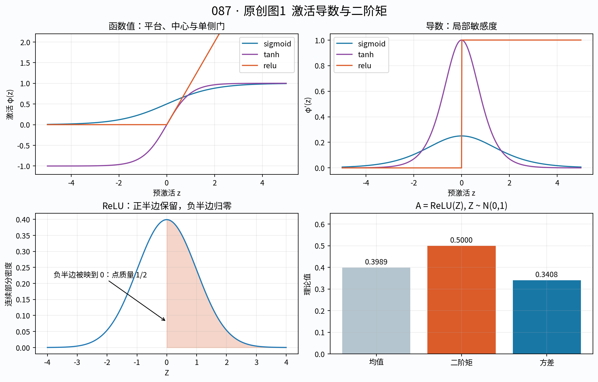
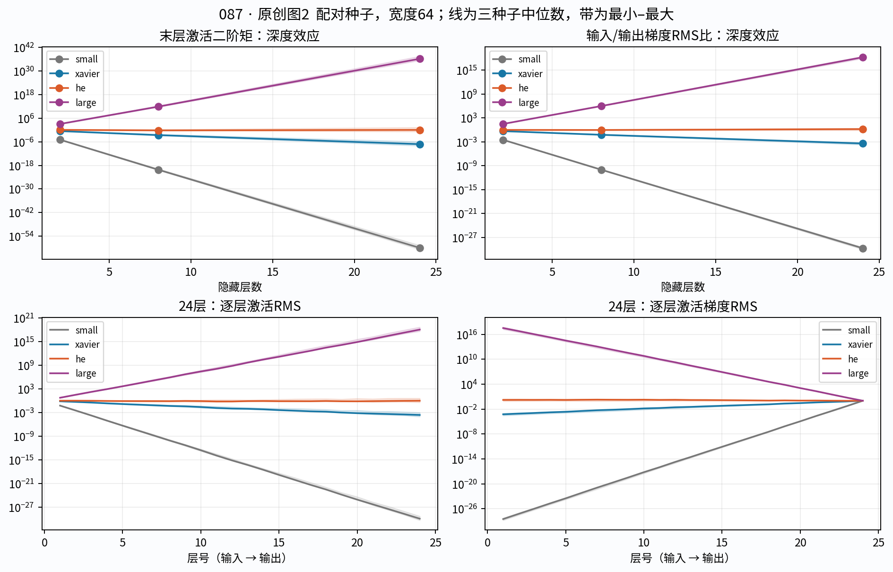
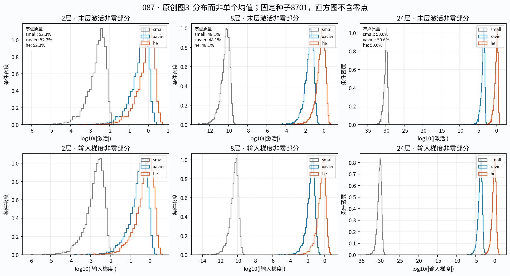
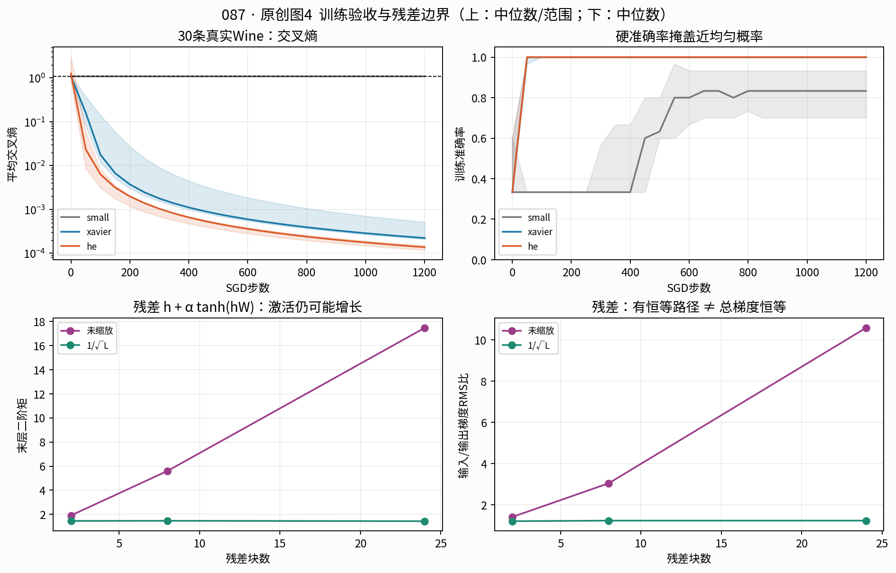

# 第087课 激活初始化与梯度传播

本课问题：一个网络还没有学到任何东西，为什么就可能已经难以训练？我们把“输出看起来正常”“梯度能传回来”“参数真的在学习”和“能够拟合一小批数据”分开检查。核心不是背两条初始化公式，而是知道公式控制了什么平均量、依赖哪些假设，以及什么时候应该相信实际测量。

直接先修：015、021、034、083、085至086。需要会向量、矩阵、期望与方差、链式法则，以及前向传播和反向传播。本课的实验只用NumPy，不需要GPU，也不依赖在线数据服务。读完应能独立推导Xavier与He的尺度、解释二阶矩和方差的区别、读懂逐层诊断图，并用真实小数据完成一次训练链路验收。

## 1 从一个具体故障开始

假设你用葡萄酒的13项化学测量预测三个品种，先搭六个隐藏层，每层48个神经元。运行1200步，屏幕上准确率偶尔已经超过90%，但交叉熵一直约为1.0986。你会说模型已经学会了吗？本课真实实验出现了这个现象：过小权重能让三类概率只发生极微小的排序变化，硬分类却看起来进步明显。

另一方面，换成较合适的初始化后，同样数据、网络、训练步数和学习率，在三个种子上都能达到100%训练准确率，交叉熵降到千分之一以下。这说明该结构至少有能力拟合这30条记录，也说明原来的训练配置确实有问题。但它不证明这个网络能预测新酒样，更不证明深度网络是这个小表格任务的最佳选择。

我们先在完全可控的随机输入上隔离传播机制，再做有真实标签的训练。第一部分没有优化器干预；第二部分检验完整训练链路。两个实验回答的问题不同，不能互相代替。

## 2 符号不是装饰：每个量都要有形状

设第$l$层输入宽度为$n_{l-1}$，输出宽度为$n_l$。对一个样本，$h^{(l-1)}$是长度$n_{l-1}$的列向量；$W^{(l)}$是$n_l\times n_{l-1}$矩阵；$b^{(l)}$是长度$n_l$的偏置；$z^{(l)}$叫预激活，$h^{(l)}$叫激活。

$$z^{(l)}=W^{(l)}h^{(l-1)}+b^{(l)},\qquad h^{(l)}=\phi(z^{(l)}).$$

第$j$个神经元做的是

$$z_j^{(l)}=\sum_{i=1}^{n_{l-1}}W_{ji}^{(l)}h_i^{(l-1)}+b_j^{(l)}.$$

求和表示这个神经元收集所有输入的加权贡献。$\phi$逐元素作用，不会混合不同神经元。本课代码为了让一行对应一个样本，保存批量矩阵$H\in\mathbb R^{B\times n_{l-1}}$以及权重$W\in\mathbb R^{n_{l-1}\times n_l}$，所以代码写成$Z=HW+b$。这是转置后的存储约定，数学机制不变。矩阵前后顺序写错常常比初始化选择更早造成问题。

$B$是批大小；$L$是隐藏层数；$\sigma_w^2$是某层单个权重的初始化方差。不要把网络宽度、输入特征数和样本数混为一谈。fan_in是一个输出单元收到多少输入，fan_out是一个输入单元向多少输出连接，二者都不是批大小。

## 3 局部导数如何变成长链

令$\mathcal L$为标量损失，$g^{(l)}=\partial\mathcal L/\partial h^{(l)}$。先经过激活，再经过线性层，链式法则给出

$$\delta^{(l)}=g^{(l)}\odot\phi'(z^{(l)}),\qquad g^{(l-1)}=(W^{(l)})^T\delta^{(l)}.$$

符号$\odot$表示对应位置相乘；$\delta$是对预激活的梯度；转置矩阵把输出方向的敏感度送回输入。对权重的梯度是

$$\frac{\partial\mathcal L}{\partial W^{(l)}}=\delta^{(l)}(h^{(l-1)})^T.$$

所以权重梯度小可能来自反传信号小，也可能来自前向激活小，两者不能只凭最终梯度范数区分。一个通道在输入方向几乎常数，即使后方梯度不小，这个通道也很难贡献有效更新。

若每层雅可比为$J_l=\partial h^{(l)}/\partial h^{(l-1)}$，整体雅可比是$J_LJ_{L-1}\cdots J_1$。标量直觉是$0.8^{24}\approx0.00472$，$1.2^{24}\approx79.5$；反复乘略小或略大的数，最终差距很大。矩阵还有方向旋转，因此“平均大小合适”仍不保证每个方向都合适。

## 4 三种激活的导数，逐步看明白

Sigmoid定义为$\sigma(z)=1/(1+e^{-z})$。对分母取导并整理，可得$\sigma'(z)=\sigma(z)[1-\sigma(z)]$。当$z=0$时，输出是$1/2$，导数为$1/4$；离开零点，导数更小。正负极大输入使输出贴近1或0，这时激活处于饱和区域，输入再变化很多，输出也只变一点。

Tanh定义为$(e^z-e^{-z})/(e^z+e^{-z})$，导数为$1-\tanh^2(z)$。在零点导数为1，正负两端趋近0。它以零为中心，但“中心对称”并不意味着永远不会饱和；若权重过大，预激活也会很大。

ReLU定义为$\max(0,z)$。正半轴导数是1，负半轴导数是0；零点不可微，代码必须选定约定，本实验取0。连续随机初始化下恰好位于零点的概率通常为零，但浮点运算、零输入或全零偏置可能制造精确的零，所以约定仍需要说明。

ReLU的正半轴不饱和，并不意味着它处处传梯度。负半轴被关闭；一个单元在整个训练批上都关闭时，当前批不能通过这个单元的ReLU更新其输入权重。偶尔一半样本关闭是普通门控，不等于永久“死亡”。要宣称死单元，需要跨样本、跨时间检查，不能把一次输出为零当成死亡证明。

图1前三幅曲线用解析公式生成。右下角是标准正态输入经过ReLU后的理论均值、二阶矩和方差，它们刻意不相等。图中“点质量”指概率集中在一个准确值上，不是一个很窄但连续的峰。

## 5 最容易写错的一步：二阶矩不等于方差

随机变量$A$的均值是$\mu=E[A]$；二阶矩是$q=E[A^2]$；方差是$v=E[(A-\mu)^2]$。展开平方后

$$v=E[A^2]-2\mu E[A]+\mu^2=q-\mu^2.$$

因此$q=v+\mu^2$。只有均值为零时，两者相等。代码里mean(x*x)是二阶矩，var(x)是方差，sqrt(mean(x*x))是均方根RMS。RMS衡量相对于零的典型大小；标准差衡量围绕均值的波动。它们服务于不同问题。

举个无需概率积分的例子：四个激活值是$[0,0,1,3]$。均值为1，二阶矩为$10/4=2.5$，方差为$2.5-1=1.5$。若直接把二阶矩2.5写成方差，就漏掉了非零均值的贡献。这个错误在ReLU中尤其常见，因为负值被截掉后均值通常变成正数。

再看标准正态$Z$经过ReLU得到$A$。正态分布关于零对称，平方是偶函数，因此正半轴恰好贡献一半平方期望：$E[A^2]=E[Z^2]/2=1/2$。同时正半轴的一阶积分得到$E[A]=1/\sqrt{2\pi}$。所以

$$\operatorname{Var}(A)=\frac12-\frac1{2\pi}\approx0.340845.$$

“He保留ReLU后的方差，所以ReLU后方差还是1”并不是这个推导。我们要追踪的主要量是二阶矩。即使预激活是零均值，激活也可以不是零均值。

## 6 一层线性组合的传播式从哪里来

先省略层号，考虑$Z=\sum_{i=1}^{n}W_iH_i$，偏置先置零。假设本层权重独立、均值为零、每个权重方差都是$\sigma_w^2$，并与进入本层的激活独立。期望的随机性同时包含初始化与输入抽样。

均值先算：$E[W_iH_i]=E[W_i]E[H_i]=0$，因此$E[Z]=0$。平方展开成对角项与交叉项：

$$E[Z^2]=\sum_iE[W_i^2H_i^2]+\sum_{i\ne j}E[W_iW_jH_iH_j].$$

独立零均值权重使交叉项为零；每个对角项等于$E[W_i^2]E[H_i^2]=\sigma_w^2 E[H_i^2]$。若输入各坐标有相同二阶矩$q$，得到

$$\operatorname{Var}(Z)=E[Z^2]=n\sigma_w^2q.$$

注意这里允许$H_i$有非零均值；关键是权重为零均值。因此正确右侧是输入二阶矩，而不是一律用输入方差。这也是非线性激活后继续计算时必须小心的地方。

有限网络中“在一个已经抽好的权重矩阵上，沿样本算统计量”，与“把输入和权重都当随机变量求总体期望”不是同一个统计操作。理论总体均值为零，不保证一次固定网络的每个神经元样本均值恰好为零。实验会把批量与神经元展开统计，并通过三个种子展示浮动；这些是诊断量，不是理论等式的逐层精确验证。

## 7 Xavier：先满足近线性的理想要求

若激活在零点附近接近恒等函数，例如小预激活的tanh，有$\phi(z)\approx z$与$\phi'(z)\approx1$。前向保持每坐标尺度，要求$n_{in}\sigma_w^2\approx1$。反向在梯度与权重近似独立、坐标二阶矩相近时，要求$n_{out}\sigma_w^2\approx1$。

当输入和输出宽度相同，两个条件可以同时满足。宽度不相同时，一般无法用一个标量方差同时精确满足。Xavier采用折中

$$\sigma_w^2=\frac{2}{n_{in}+n_{out}}.$$

这个式子等价于让前向乘子与反向乘子的算术平均为1。它不是两个理想方差$1/n_{in}$与$1/n_{out}$的算术平均。若$64\to32$，方差为$2/96=1/48$，前向乘子为$4/3$，反向乘子为$2/3$，平均为1。[1]

本课用正态版：先抽$G\sim\mathcal N(0,1)$，再令$W=G\sqrt{2/(n_{in}+n_{out})}$。传给正态抽样器的是标准差而非方差。若使用对称均匀分布$U[-a,a]$，它的方差为$a^2/3$，所以对应边界为$a=\sqrt{6/(n_{in}+n_{out})}$。两个分布方差相同，不表示有限样本的尾部或谱性质完全相同。

Xavier不是“任何激活都自动稳定”的保证。Sigmoid零点导数只有1/4，ReLU会删除负半边平方质量，这些都偏离近恒等条件。对tanh而言，若预激活本身较大，近线性近似也会失效。

## 8 He：把ReLU丢掉的一半平方质量补回来

设预激活$Z$关于零对称，且$A=\max(0,Z)$。无需假设$Z$严格为正态，对称性已经足够保证$E[A^2]=E[Z^2]/2$。结合上一节的一层传播式：

$$q_l=E[(H^{(l)})^2]\approx\frac12n_{l-1}\sigma_{w,l}^2q_{l-1}.$$

希望乘子为1，就令

$$\sigma_{w,l}^2=\frac{2}{n_{l-1}},\qquad \operatorname{std}(W)=\sqrt{\frac{2}{n_{l-1}}}.$$

这就是fan_in版He初始化的核心尺度。[2] 等宽64时，标准差为$\sqrt{2/64}\approx0.176777$。Xavier在同样宽度下标准差为0.125；固定标准差0.01会让单层二阶矩乘子约为$64\times0.01^2/2=0.0032$。

反向分析中，ReLU门的平方仍等于这个门本身，若打开概率约为1/2，并近似忽略门与上游梯度的相关性，反向每坐标二阶矩乘子约为$n_{out}\sigma_w^2/2$。fan_out版He因此用$2/n_{out}$。输入输出宽度相等时，两者一致；宽度变化很大时，要知道自己更想优先保持哪个方向的每坐标量。

Leaky ReLU把负半轴斜率设为$a$，对称预激活下二阶矩保留比例变成$(1+a^2)/2$，相应fan_in尺度是$2/[(1+a^2)n_{in}]$。这里$a$是负斜率，不是激活值，也不是均匀分布的边界。一个符号在不同文献里可能有不同含义，复现前要重新标注。

## 9 别把边界层机械当成内部隐藏层

输入层前面没有ReLU，因此推导中“先线性，再ReLU”的组合需要与实际结构对齐。若第一层使用He，标准化输入二阶矩约为1，预激活二阶矩约为2，再经ReLU回到约1，这个约定是自洽的。

输出层通常直接产生logits，后面接softmax和交叉熵，并没有需要补偿的ReLU。对输出层沿用He不一定导致失败，但不能援用“补回半边”的理由。本课真实训练把所有配置的最后线性层固定为Xavier，使初始化干预只发生在隐藏层。这样观察到的差异更容易解释。

零偏置是控制实验的起点。把所有权重初始化为零通常会保留神经元之间的对称性，阻碍它们学到不同特征；零偏置却很常见，因为独立随机权重已经破坏了这种对称。两句话并不冲突。偏置很大还会把tanh、sigmoid推入饱和或把ReLU整体推到一侧，使零均值与半开门假设不再适用。

## 10 梯度范数要先说明“对谁求导”

本课传播实验不接一个任意的分类损失，而是在最后激活上放置一个独立的随机上游矩阵$U$，定义探针标量$S=\sum_{ij}H^{(L)}_{ij}U_{ij}$。于是对最后激活的梯度恰好是$U$。这相当于给网络一个固定的反向测试信号，再看输入端收到多少。

$U$和输入、权重各用独立随机流。不同深度和初始化共享相同输入、相同形状的$U$，同种子下还共享标准正态权重底稿，只改变缩放。这样比“每次随便重抽一切”更容易归因。

若矩阵$G$有$M$个元素，Frobenius范数为$\|G\|_F=\sqrt{\sum G_{ij}^2}$，RMS为$\|G\|_F/\sqrt M$。本实验主要报告输入梯度RMS与输出梯度RMS之比。等宽时它也等于Frobenius范数比；不等宽时就不一定相同。平均损失和总损失的梯度还差批大小倍数，所以跨代码比较绝对范数之前必须核对损失的reduction。

上游探针只能测试初始化处的一个随机方向。它不是训练损失梯度，更不是全部奇异值。若某些方向被大幅放大、另一些被压扁，一个平均RMS可能掩盖二者；需要更强诊断时，应查看雅可比谱或多个独立方向，但本课不把一个探针伪称完整谱分析。

## 11 预先固定实验，才不容易挑结果

传播实验统一使用float64、批量128、宽度64，隐藏深度为2、8、24。输入种子8700，上游梯度种子8799，权重种子8701、8702、8703。每个深度都测试ReLU的small、Xavier、He、large四个初始化；另测试tanh和sigmoid的Xavier与large。small标准差0.01，large标准差1，这两个刻意的反例不是推荐设置。

每层记录预激活和激活的均值、方差、二阶矩、RMS、零值比例，以及对激活和预激活的梯度。还记录导数绝对值小于0.01的比例。对tanh、sigmoid可把它当作一个操作性饱和指标；对ReLU，它主要表示关闭门比例，不能解释成与sigmoid相同的饱和机制。

三种子中位数用于概括，最小至最大用于展示有限重复的跨度。这不是置信区间，也不足以估计全部初始化风险。默认脚本保存所有原始逐层结果，不只保存最漂亮的一条。

图2对数纵轴让许多数量级可以同时出现。阴影只代表三个种子的范围；不能把阴影窄理解为统计上已经确定。右下角层号仍从输入到输出，反向传播的计算顺序则相反。

## 12 先用理论数量级预测，再读实测

等宽ReLU配Xavier时，理想二阶矩每层约乘1/2，因此24层末端应约为$2^{-24}\approx5.96\times10^{-8}$。实测三个种子的中位数为$5.912\times10^{-8}$，很接近这个数量级。对应输入/输出梯度RMS比约$3.858\times10^{-4}$。RMS是平方量的平方根，因此不要误把二阶矩倍率直接当作RMS倍率。

small的末层二阶矩中位数为$1.318\times10^{-60}$，梯度RMS比为$1.822\times10^{-30}$；large分别达到$1.318\times10^{36}$和$1.822\times10^{18}$。它们展示的是初始化处的强烈缩小与放大，还不是“训练已经数值溢出”的证据。本实验float64仍可表示这些数，但实际更新很容易因尺度失衡而困难。

He的24层末层二阶矩中位数约0.992，梯度RMS比约1.580。它保持在合理数量级，并没有做到每层每个方向精确等于1。有限宽度、门控和方向相关性都会造成偏离。不能因为1.58不是1就宣布理论被推翻，也不能因为中位数好看就宣布任意更深网络一定稳定。

同样，Xavier在六层真实训练中能够很好拟合，和它在24层ReLU传播中逐渐缩小并不矛盾。初始化是训练起点，深度和后续更新会改变现象；“相对更难”不等于“绝对不能训练”。

## 13 看分布，才能发现平均量藏住的事

每层只有一个均值会隐藏大量细节。全为0与一半为-100、一半为100的均值都为0，但表达与梯度行为完全不同。方差、二阶矩、分位数、零点质量需要联合看。

图3绘制激活非零部分的$\log_{10}|a|$和输入梯度非零部分的$\log_{10}|g|$。负30表示原始绝对值约$10^{-30}$，不是“梯度值等于-30”。激活在零点的概率质量单独标出，因为对零取对数没有有限结果。图中直方图是给定非零条件下的密度，不可把曲线面积误认为所有样本的概率都在其中。

同一种子下，三种正缩放的ReLU网络有相同门控模式，因为零偏置和ReLU的正齐次性：$\operatorname{ReLU}(cx)=c\operatorname{ReLU}(x)$，其中$c>0$。所以相同深度的零值比例一致，而非零分布整体移动。这个细节是控制实验的可解释性优势，并非绘图误把同一组数据画了三次。若加入非零偏置、换成tanh或开始训练，这个精确关系通常就不再成立。

## 14 饱和不等于所有梯度一定同时消失

24层sigmoid配Xavier时，末层激活二阶矩约0.248，输出看起来完全不接近全零，但输入梯度RMS比只有$6.94\times10^{-16}$。末层导数小于0.01的比例中位数还是0。这说明即便没有大量“极端饱和”单元，反复乘最大只有1/4的局部导数也能导致强烈衰减。把梯度问题只归结为输出贴边，诊断会漏掉这一类情况。

反方向也值得注意：large初始化的tanh在24层末端约69.5%的导数小于0.01，但输入梯度RMS比中位数却约$4.67\times10^7$。多数单元饱和不代表剩余路径不能被大权重强烈放大。必须同时看导数、权重、方向及最终范数，不能只数饱和单元就宣布整体梯度消失。

“爆炸”与“消失”甚至可以在同一网络的不同方向、不同样本或不同层同时发生。平均RMS大可能来自少数异常分量。因此真正排查训练时，还应看最大绝对值、非有限值比例、按样本的分布，并记录是激活梯度还是参数梯度。

## 15 残差路径为什么有帮助

普通层是$h_{l+1}=F_l(h_l)$。简化残差块是$h_{l+1}=h_l+\alpha F_l(h_l)$，其中$\alpha$是残差分支缩放。对输入求导：

$$J_l=I+\alpha J_{F_l},\qquad g_l=g_{l+1}+\alpha J_{F_l}^Tg_{l+1}.$$

$I$是恒等矩阵；它把同一方向直接传过来。即使残差分支导数较小，仍有一条加法路径。多块展开会出现不经过某些残差变换的项，这有助于理解深网络为何可以从接近恒等映射的状态开始调整。[3]

但“有$I$”不等于“最终梯度必定至少和原来一样大”。两条路径可能抵消。标量反例：若$F'(h)=-1$、$\alpha=1$，总导数$1+F'=0$；若$F'=1$，24块总导数是$2^{24}=16777216$。恒等项存在，梯度仍可消失或爆炸。

还有结构边界。若加法之后再接ReLU，雅可比外面又乘一个门，恒等路径也可能被关闭；若用投影矩阵调整维度，跳连不再是严格的$I$；若跳连上有缩放、归一化或门控，也必须把它们纳入导数。残差论文的严格传播式有明确结构条件，不能直接搬给所有名叫“残差”的模块。

## 16 残差前向尺度也要计算

对标量坐标，有

$$E[(H+\alpha F)^2]=E[H^2]+2\alpha E[HF]+\alpha^2E[F^2].$$

中间项是相关项，不能未经说明就扔掉。如果二者均值不为零，还不能直接把$E[HF]$叫协方差；协方差还需要减去均值乘积。即使相关项近似为零，分支每次增加的二阶矩也会随深度累积。

本课残差探针使用$h\leftarrow h+\alpha\tanh(hW)$，不是完整ResNet复现。宽度64，三个种子，比较$\alpha=1$与$\alpha=1/\sqrt L$。24块时未缩放的末层二阶矩中位数约17.458，梯度RMS比约10.571；缩放后的对应值约1.438与1.242。这个实验说明分支缩放在本配置中控制了增长，不说明它是所有残差网络的最优规则，也没有替代归一化或深度专门初始化的完整分析。

## 17 真实小数据：为什么故意追求过拟合

在准备大规模训练之前，先问一个很朴素的问题：模型能不能把30条已经看过的真实记录记住？如果容量明显足够却做不到，应该优先怀疑标签对应、预处理、前向、梯度、更新和初始化，而不是立刻增加数据或算力。这是一项训练链路的烟雾测试。

本课从UCI Wine的随包副本冻结每类原始行号最前面的10条，共30条，保留全部13特征和原标签；顺序在训练前确定，不按照拟合表现挑行。Wine数据来自真实化学测量，原库共有178条、三个品种，使用CC BY 4.0许可。[4] 交付包已包含这30条原始值，运行实验不需要scikit-learn，也不需要下载。

标准化参数只由这30条训练记录计算。每列减去其均值，再除以总体标准差，代码采用ddof=0。这里没有验证集和测试集，因为目标明确是刻意记忆这30条样本。不能给训练成绩改名叫测试成绩。将来若评价泛化，必须另建分割并重新规定预处理和模型选择职责。

## 18 训练协议与验收门槛

模型是13→48→48→48→48→48→48→3，六个ReLU隐藏层，最后一层为线性logits。偏置初始为零。所有配置使用相同原始标准正态权重底稿，隐藏层分别使用small、Xavier、He，输出层始终Xavier。优化器为全批量普通梯度下降，学习率0.05，固定1200步，无动量、权重衰减、归一化或梯度裁剪。

记忆成功预先同时要求训练准确率等于100%且平均交叉熵小于0.02。前者要求所有硬预测正确；后者排除“只是以极微小差距碰巧排对”的情况。损失阈值并不是概率校准证明，只是这一诊断任务清楚可复核的验收标准。

交叉熵使用稳定的log-softmax：每行logits减去最大值，再计算指数和的对数。对真实类别的负对数概率求均值。反向梯度为$(P-Y)/B$，其中$P$是预测概率矩阵，$Y$是真实类别的one-hot矩阵。除以$B$只做一次；若在每层再除一次，深层梯度会被人为压小。

图4上半部分是三种子训练曲线，下半部分是独立的残差传播诊断。两组图共用一个版面，但不是同一个模型，也不能用下半部分解释上半部分的全部差异。

## 19 冻结结果：允许好结果和反例一起存在

He三种子的最终交叉熵分别约为0.000137、0.000119、0.000152，训练准确率都是100%。Xavier对应约0.000516、0.000210、0.000222，也全部通过验收。这个实验支持“两个配置在当前网络与预算下都能训练”，不能写成“只有He能训练”。

small的交叉熵分别约为1.098612265、1.098612270、1.098612277，和均匀三分类的$\log3\approx1.098612289$极其接近，但硬准确率分别达到83.3%、93.3%、70.0%。比如预测概率是$[0.33333334,0.33333333,0.33333333]$时，第一类被选中，然而并没有形成明显的概率偏好。微小变化足以改变argmax，损失却揭示模型几乎仍停在均匀预测。

种子8701的初始首层权重梯度范数，small约$1.89\times10^{-7}$，Xavier约0.114，He约0.546。这些值还受到输出层和实际标签的影响，不能直接和无监督传播探针的RMS比混算。它们共同说明，真实训练里也出现了尺度差异。

## 20 为什么增大学习率不能包治百病

参数更新是$\Delta W=-\eta\nabla_W\mathcal L$。当某层梯度特别小，提高全局学习率$\eta$的确可能增加该层步长，但它也会同时放大其他层，导致原本正常的层震荡或发散。如果梯度精确为零，任何有限学习率乘零仍然为零。

更严重时，小梯度反映的是方向信息已经丢失或严重失真。把一个几乎没有有效信号的数乘大，不等于恢复正确方向。初始化控制信号尺度，学习率控制沿当前梯度走多远，二者相关却不是同一旋钮。

梯度裁剪主要限制过大更新，不能使已经消失的梯度自动回来；归一化会改变传播条件，但仍需要检查位置和训练/评价状态。本课不把这些手段混入主实验，是为了让初始化比较有清楚解释。下一课再系统讨论优化实践。

## 21 一份可以照做的诊断顺序

先检查数据和损失：特征单位是否悬殊，标签是否是正确整数，样本与标签是否对齐，损失有没有重复平均，是否出现NaN或无穷。再用小网络和有限差分核对梯度，确保问题不是实现错误。

然后固定一批输入，记录初始化处逐层激活和梯度；同时保留均值、方差、二阶矩、RMS以及零值比例。观察异常首次出现在哪层，而不是只看最后输出。改变初始化时，保持宽度、输入、随机底稿和上游探针一致，避免一次修改五个因素。

接着关闭不必要的正则化和随机增强，用极小真实样本尝试记忆，固定成功门槛与训练预算。若过不了，逐项排查：更新是否真正写回参数，梯度方向是否正确，激活是否关闭，隐藏层是否得到学习信号。若过得了，再恢复验证协议和正则化；通过记忆测试只是进入下一阶段的许可证。

最后记录失败。一个种子失败是信息，不应无声换种子直到得到好图。要改实验，就说明改了什么、为何改、哪些结果属于旧协议。科学判断依赖可追溯的对照，不依赖一张美观曲线。

## 22 本课代码如何对应推导

activate与derivative对应激活及局部导数；weight_std只负责返回标准差；moments同时保存均值、方差、二阶矩与RMS，避免读者把名字相近的统计量混用。forward返回全部中间激活和预激活，因为反向过程需要知道当时的门控状态。

input_vjp沿反向次序把上游矩阵乘激活导数，再乘权重转置。probe建立控制实验；probe_samples为分布图重建固定种子的真实样本值。residual_vjp把直接路径和分支路径相加，并用有限差分单独验证。

loss_and_grad实现稳定交叉熵及全部权重、偏置梯度；train_tiny真的执行1200次参数更新，保存损失、准确率和首末层梯度范数。run返回完整JSON字典；plots读取冻结结果并画图。测试使用unittest，不依赖会被python -O删除的裸assert，正常与优化解释器都已运行。

## 23 结论的边界，也是下一步的入口

Xavier和He给出的是在特定近似条件下保持平均尺度的起点。实际网络中的有限宽度、数据相关性、参数训练后的依赖、非零偏置、归一化、共享权重与特殊结构都会改变传播。不要把两条公式当作整个优化理论。

本课提供三层证据：公式给出数量级预测；受控实验展示初始化处的传播；真实小数据检验完整训练链路。三者互相补充，却不互相越权。我们没有做完整雅可比谱分析、没有估计泛化误差、没有复现大型ResNet，也没有比较所有可能初始化。

最值得保留的习惯是：每当看到一个“稳定”结论，都问它稳定的是均值、方差、二阶矩、范数还是所有方向；每当看到一个“学会了”结论，都问它来自训练损失、硬准确率还是未见数据。说清楚量与边界，才能把直觉变成可复核的判断。

## 来源与复核

[1] Glorot与Bengio，2010，原论文第4.2节及公式10–12：[PMLR原文](https://proceedings.mlr.press/v9/glorot10a/glorot10a.pdf)。

[2] He等，2015，第2.2节、公式7–10与反向讨论：[作者原论文](https://arxiv.org/pdf/1502.01852)。

[3] He等，2016，第2节传播推导及第3至4节结构条件：[Identity Mappings原文](https://arxiv.org/pdf/1603.05027)。

[4] Aeberhard与Forina，Wine数据与CC BY 4.0许可：[UCI官方页](https://archive.ics.uci.edu/dataset/109/wine)。

逐项核验范围见sources.md。所有图均由本课plots.py原创生成，理论图、初始化探针与真实训练结果已分别标明。
